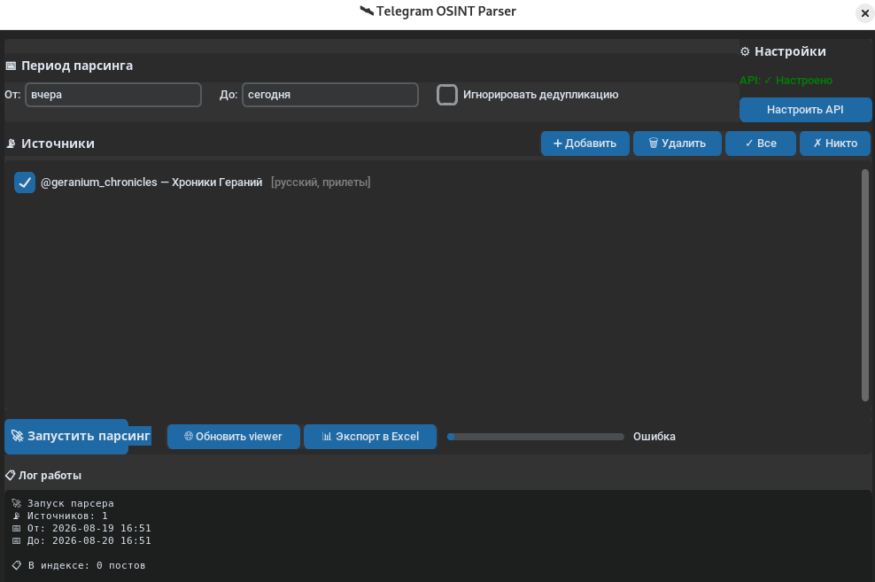

# Telegram OSINT Parser
## Дисклеймер

Этот инструмент предоставляется "как есть" (as is), без каких-либо гарантий работоспособности, безопасности или пригодности для конкретных целей.

**Использование на собственный риск.** Автор не несёт ответственности за:
- Временную или постоянную блокировку Telegram-аккаунта в результате использования инструмента.
- Потерю данных, утечку конфиденциальной информации или иные убытки.
- Последствия использования инструмента в нарушение законодательства страны пользователя или правил третьих лиц.

**Правовой статус.** Парсинг Telegram-каналов через пользовательский аккаунт (userbot) формально ограничен правилами Telegram (Terms of Service). Инструмент предназначен исключительно для законного сбора общедоступной информации в личных, исследовательских или журналистских целях. Использование для массового скрейпинга, спам-рассылок, преследования пользователей или иных злоупотреблений запрещено.

**Безопасность credentials.** Файлы `config.json` и `session_name.session` содержат конфиденциальные данные (API-ключи Telegram и сессию аккаунта). Никогда не коммитьте их в репозиторий и не передавайте третьим лицам. Файлы добавлены в `.gitignore`, но перед каждым коммитом проверяйте вывод `git status`.

**Этика OSINT.** Собирайте только те данные, которые имеют законные основания для обработки. Уважайте приватность лиц, упоминаемых в материалах.

Локальный инструмент для сбора и структурирования сообщений из Telegram-каналов. Ориентирован на мониторинг военно-новостных и OSINT-каналов: автоматически извлекает координаты, типы вооружений, населённые пункты и страны, раскладывает события по категориям и сохраняет в машиночитаемом виде.

Все данные хранятся локально на диске. Никаких облаков и внешних сервисов, кроме самого Telegram API.


## Что делает

Инструмент работает в три этапа:

1. **Сбор** — подключается к списку Telegram-каналов через userbot-аккаунт, выкачивает сообщения за заданный период.
2. **Фильтрация и извлечение** — отбирает посты по ключевым словам-триггерам, регулярными выражениями вытаскивает координаты, по словарям определяет тип ракеты, город и страну, классифицирует событие по категории.
3. **Сохранение и представление** — каждое событие пишется в отдельный JSON-файл в папку по категории. Параллельно ведётся индекс для дедупликации. Собранные данные можно посмотреть в виде интерактивной HTML-карты или выгрузить в Excel.

GUI-лаунчер (`start_parser.py`) объединяет все этапы в одном окне: настройка API, управление списком каналов, запуск парсинга, сборка viewer'а и экспорт — без необходимости лезть в консоль.

## Что конкретно ищем

### Ключевые слова-триггеры

Пост попадает в обработку, только если в тексте встречается хотя бы одно из слов:

```
прилёт, прилет, удар, ракета, шахед, искандер, калибр,
взрыв, дрон, бпла, перехват, сбит
```

Сравнение идёт по нижнему регистру, без учёта словоформ.

### Категории событий

По дополнительным словам посту присваивается категория, которая определяет папку сохранения и цвет маркера на карте:

| Категория | Триггеры |
|---|---|
| `прилёты` | прилёт, прилет, удар, взрыв |
| `перехваты` | перехват, сбит |
| `дроны` | дрон, бпла |
| `прочее` | всё остальное, что прошло по базовым триггерам |

Проверка категорий идёт в порядке приоритета: сначала `прилёты`, потом `перехваты`, потом `дроны`. Если сработали несколько — берётся первая.

### Извлекаемые поля

Из текста каждого поста парсер пытается вытащить четыре типа сущностей:

**Координаты** — регулярными выражениями, в двух форматах:
- Десятичные градусы: `55.7558, 37.6173` или `55.7558 37.6173`
- Градусы-минуты-секунды: `55°45′21″ с. ш. 37°37′04″ в. д.`

Проверяется валидность диапазона (±90 для широты, ±180 для долготы). Если в посте несколько пар координат — сохраняются все, но на карте и в Excel используется первая.

**Тип ракеты** — поиск по словарю:
```
шахед, shahed, искандер, калибр, х-101, x-101, х-47, x-47,
х-59, x-59, х-22, x-22, s-300, с-300, s-400, с-400,
patriot, томагавк, атакмс
```

**Населённый пункт** — поиск по словарю городов:
```
киев, харьков, одесса, львов, днепр, запорожье, херсон,
москва, санкт-петербург, белгород, курск, воронеж, ростов,
минск, гомель, варшава, кишинёв
```

**Страна** — поиск по словарю:
```
украина, россия, беларусь, польша, молдова, грузия
```

Словари захардкожены в `parser.py` в константах `MISSILE_TYPES`, `CITIES`, `COUNTRIES`. Расширяются редактированием файла.

### Структура JSON-файла события

Каждый обработанный пост сохраняется как отдельный JSON:

```json
{
  "id": 12345,
  "channel_username": "voenkor_xyz",
  "channel": "Военкор XYZ",
  "date": "2026-08-20T14:32:00",
  "category": "прилёты",
  "full_text": "Прилёт Шахедом по Одессе. Координаты: 46.4775, 30.7326...",
  "link": "https://t.me/c/...",
  "geo": {
    "coordinates": [
      {"lat": 46.4775, "lon": 30.7326, "format": "decimal"}
    ],
    "location_name": "одесса",
    "country": "украина"
  },
  "military": {
    "missile_type": "шахед"
  }
}
```

Если какое-то поле не удалось извлечь — оно сохраняется как `null` (или пустой список для координат).

## Установка

Требования: Python 3.10 или новее.

```bash
git clone https://github.com/saabst/telegram-osint-parser.git
cd telegram-osint-parser
python -m venv venv
source venv/bin/activate        # Linux/macOS
# venv\Scripts\activate         # Windows

pip install telethon customtkinter dateparser rich pandas openpyxl xlsxwriter
```

## Настройка Telegram API

Для работы нужен userbot-аккаунт. Боты не умеют читать чужие каналы.

1. Зайти на https://my.telegram.org, авторизоваться по номеру телефона.
2. Перейти в **API development tools**, создать приложение.
3. Скопировать `api_id` (число) и `api_hash` (строка).
4. Запустить `python start_parser.py`, нажать **Настроить API**, ввести api_id, api_hash и номер телефона в формате `+79991234567`.

Настройки сохраняются в `config.json`. При первом подключении Telethon запросит код из Telegram — это нормально, сессия сохранится в `session_name.session`.

**Важно:** файл `.session` даёт полный доступ к аккаунту. Хранить его так же, как пароль.

## Запуск

### Через GUI (рекомендуется)

```bash
python start_parser.py
```

Откроется окно, в котором можно:
- настроить API credentials,
- добавить/удалить/включить/выключить каналы,
- задать период парсинга в свободном формате (`вчера`, `2026-08-01`, `3 days ago`, `20.08.2026 14:00`),
- запустить парсинг,
- собрать и открыть HTML-viewer,
- экспортировать данные в Excel.

### Через консоль

```bash
# Последние 24 часа по всем включённым каналам
python parser.py --from "24 hours ago"

# Конкретный диапазон
python parser.py --from "2026-08-01" --to "2026-08-15"

# Только определённые каналы
python parser.py --only "voenkor_xyz,osint_group"

# Исключить каналы
python parser.py --except "region_news"

# Только каналы из группы "военкоры"
python parser.py --group "военкоры"

# Игнорировать дедупликацию (переписать существующие)
python parser.py --from "2026-08-01" --force
```

### Сборка viewer'а и экспорт

```bash
python build_viewer.py          # собирает viewer.html из всех JSON
python export.py                # создаёт events_export.csv и events_export.xlsx
```

Обе команды можно вызвать из GUI кнопками **Обновить viewer** и **Экспорт в Excel**.

## Структура проекта

```
telegram-osint-parser/
│
├── start_parser.py          # GUI-лаунчер, точка входа
├── parser.py                # логика парсинга, извлечения сущностей, CLI
├── build_viewer.py          # сборка HTML-viewer из JSON-файлов
├── export.py                # экспорт в CSV и Excel
│
├── config.json              # API credentials (создаётся через GUI)
├── sources.json             # список каналов с группами и статусами
├── events_index.json        # индекс (channel, msg_id) для дедупликации
├── session_name.session     # сессия Telethon, привязана к аккаунту
│
├── events/                  # результаты парсинга
│   ├── прилёты/
│   │   ├── 2026-08-20_14-32_msg12345.json
│   │   └── ...
│   ├── перехваты/
│   ├── дроны/
│   └── прочее/
│
├── viewer.html              # интерактивный viewer (генерируется)
├── events_export.csv        # экспорт (генерируется)
└── events_export.xlsx       # экспорт (генерируется)
```

## Принцип работы дедупликации

Перед сохранением каждого поста парсер проверяет, есть ли пара `(username_канала, id_сообщения)` в `events_index.json`. Если есть — пост пропускается, счётчик дубликатов увеличивается. Если нет — пост сохраняется, пара добавляется в индекс.

Это позволяет запускать парсер повторно по тому же диапазону дат без риска получить дубли. Флаг `--force` в CLI или чекбокс **Игнорировать дедупликацию** в GUI отключают проверку.

## HTML-viewer

`viewer.html` — самодостаточный файл, открывается двойным кликом в любом браузере. Все данные встроены в него как JSON.

Возможности:
- таблица событий слева с сортировкой по дате, категории, локации;
- интерактивная карта (Leaflet + OpenStreetMap) справа с цветными маркерами по категориям;
- фильтры по категории, стране, типу ракеты;
- полнотекстовый поиск по тексту поста, локации, каналу;
- панель деталей при клике на строку или маркер — полный текст, координаты, ссылка на оригинальный пост, ссылка на Google Maps.

Для работы карты нужен интернет (тайлы грузятся с OSM). Если нужен полностью оффлайн-режим — тайлы можно предскачать и заменить в шаблоне.

## Ограничения и риски

- Парсинг через userbot формально нарушает Terms of Service Telegram. Инструмент предназначен для личного использования.
- При слишком агрессивном парсинге (тысячи сообщений за раз, много каналов параллельно) Telegram может временно ограничить аккаунт. В коде стоит задержка в 1 секунду между каналами и лимит 500 сообщений на канал по умолчанию.
- Извлечение сущностей работает на регулярных выражениях и словарях. Если в посте координаты в нестандартном формате, город написан в другом падеже или тип ракеты не входит в словарь — поле останется пустым. Для повышения качества можно подключить локальную LLM через Ollama.
- Файл `session_name.session` даёт полный доступ к аккаунту. Не передавать третьим лицам, не коммитить в git.

## Расширение словарей

Все словари (триггеры, типы ракет, города, страны) лежат в `parser.py` как константы в начале файла. Для добавления новых значений достаточно отредактировать соответствующий список и перезапустить парсер.

Для более сложных случаев (многословные названия, варианты написания, разные языки) имеет смысл вынести словари в отдельный JSON-файл и подгружать его при старте.

##Быстрый старт
# 1. Создать виртуальное окружение
python3 -m venv venv
source venv/bin/activate  # Linux/macOS
# venv\Scripts\activate   # Windows

# 2. Установить зависимости
pip install -r requirements.txt

# 3. Запустить GUI
python start_parser.py

# 4. В интерфейсе:
#    - Нажать "Настроить API", ввести credentials
#    - Добавить каналы через "Добавить"
#    - Выбрать даты (например, "вчера" и "сегодня")
#    - Нажать "Запустить парсинг"
#    - После завершения — "Обновить viewer" или "Экспорт в Excel"